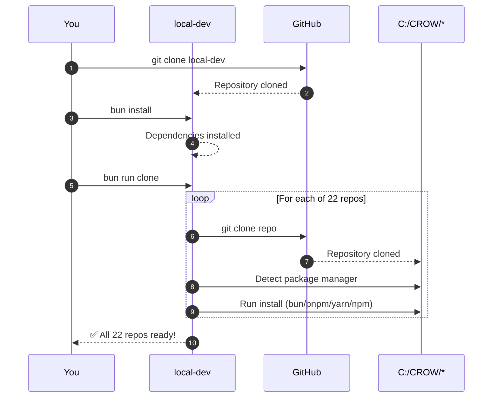
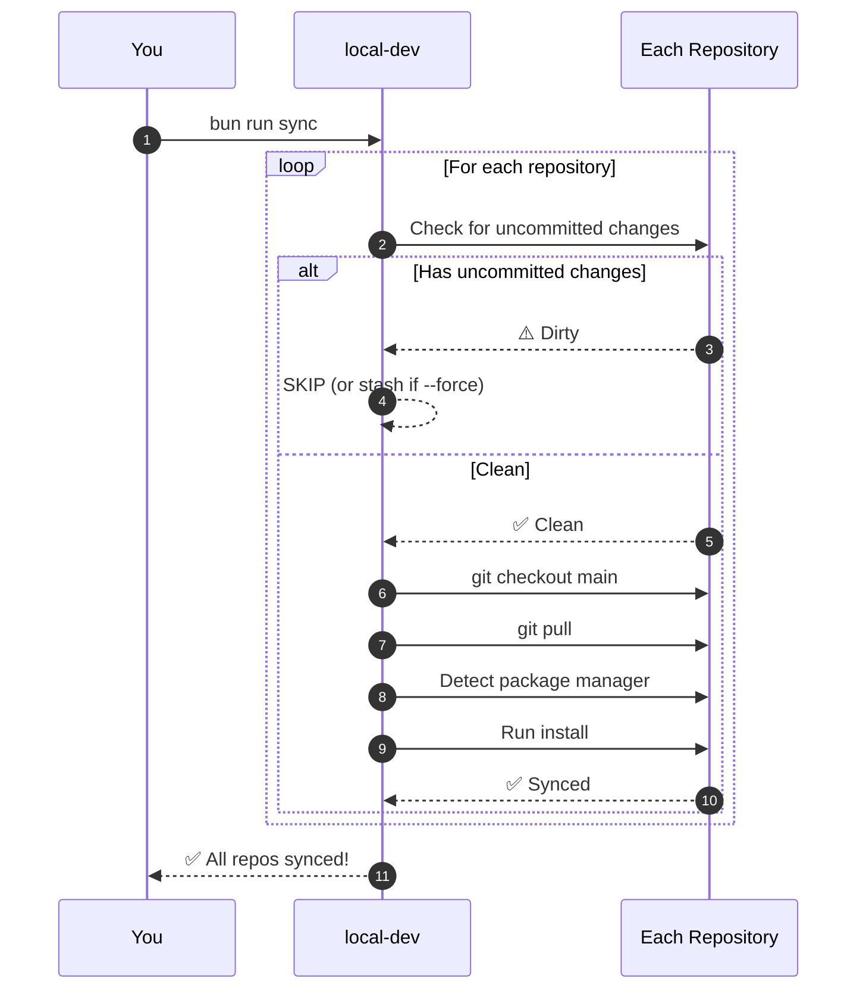
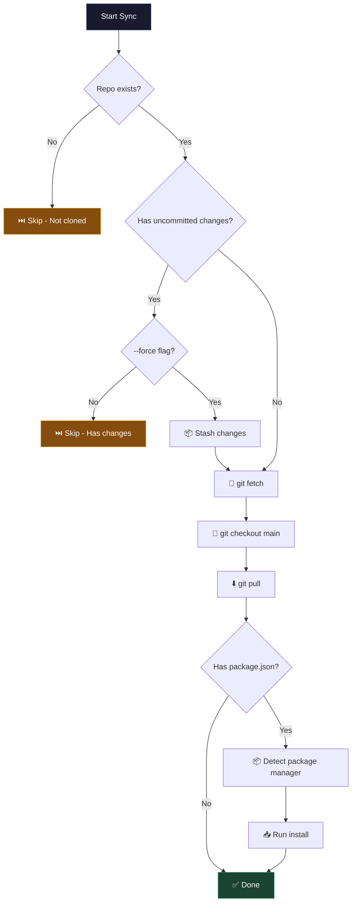
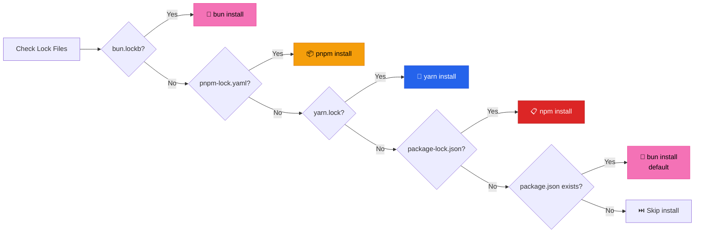
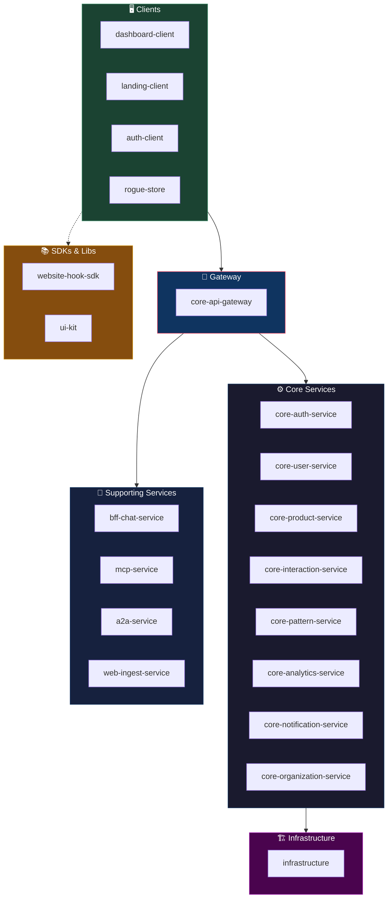
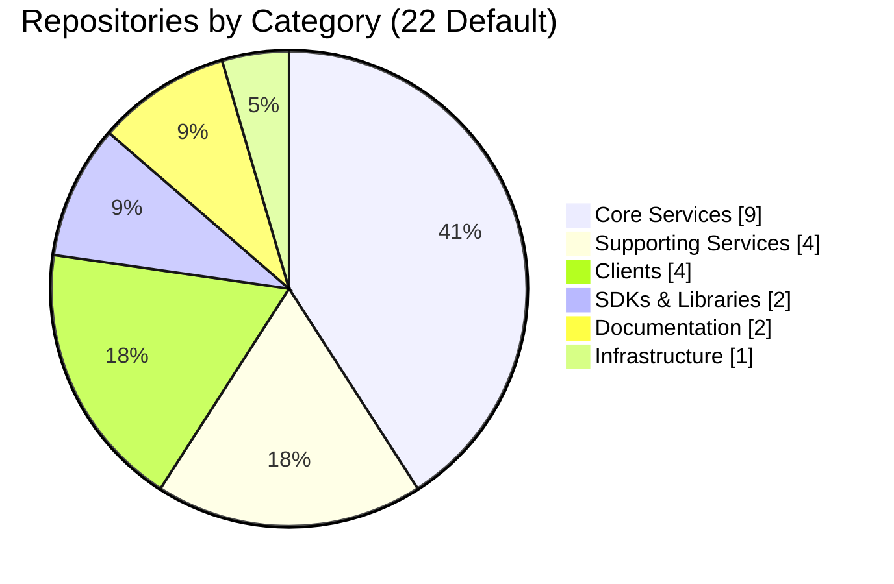
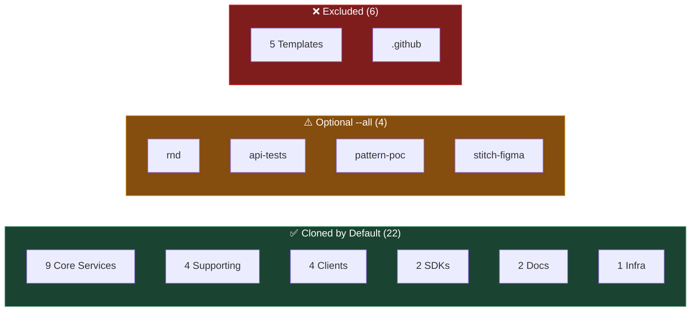

<p align="center">
  
</p>

<p align="center">
  
  
  
  
</p>

<p align="center">
  <b>One command to clone them all. One command to sync them.</b><br/>
  <sub>Local development helper scripts for the CROW-B3 organization</sub>
</p>

---

## 📋 Table of Contents

- [Overview](#-overview)
- [Quick Start](#-quick-start)
- [How It Works](#-how-it-works)
- [Commands](#-commands)
- [Repository Map](#%EF%B8%8F-repository-map)
- [Configuration](#%EF%B8%8F-configuration)
- [Troubleshooting](#-troubleshooting)

---

## 🔮 Overview

Clone this repo once, run one command, and get **ALL 22+ repositories** set up with dependencies installed. Keep everything in sync daily with a single command.


---

## 🚀 Quick Start

### Prerequisites

| Requirement | Version | Installation |
|-------------|---------|--------------|
| 🥟 **Bun** | v1.0+ | `curl -fsSL https://bun.sh/install \| bash` |
| 🔧 **Git** | Any | [git-scm.com](https://git-scm.com/) |
| 🔑 **GitHub Access** | - | Access to CROW-B3 org (for private repos) |

### Setup in 3 Steps

```bash
# ① Clone this repository
git clone https://github.com/CROW-B3/local-dev.git
cd local-dev

# ② Install dependencies
bun install

# ③ Clone all CROW-B3 repositories
bun run clone
```

**That's it!** All 22 repositories are now cloned with dependencies installed.

---

## 🔄 How It Works

### Initial Setup Flow (One-Time)



### Daily Sync Flow (Recurring)



### Sync Decision Logic



### Package Manager Detection



---

## 💻 Commands

### Clone Command

```bash
bun run clone [options]
```

| Option | Description |
|--------|-------------|
| _(none)_ | Clone 22 default repositories |
| `--all`, `-a` | Clone ALL repositories (including R&D, templates) |
| `--help`, `-h` | Show help message |

### Sync Command

```bash
bun run sync [options]
```

| Option | Description |
|--------|-------------|
| _(none)_ | Sync repos (skips those with uncommitted changes) |
| `--force`, `-f` | Stash uncommitted changes and sync anyway |
| `--all`, `-a` | Sync ALL repositories |
| `--help`, `-h` | Show help message |

### Quick Reference

| Task | Command |
|------|---------|
| First time setup | `git clone ... && cd local-dev && bun install && bun run clone` |
| Daily sync | `bun run sync` |
| Force sync (stash changes) | `bun run sync --force` |
| Clone including R&D repos | `bun run clone --all` |

---

## 🗺️ Repository Map

### Architecture Overview



### Repository Breakdown



### Workspace Structure After Clone

```
C:/CROW/                              ◀── Your workspace root
│
├── 📁 local-dev/                     ◀── You are here
│   ├── 📄 package.json
│   ├── 📄 repos.config.ts
│   └── 📁 src/
│
├── ⚙️ CORE SERVICES (9)
│   ├── core-api-gateway/
│   ├── core-auth-service/
│   ├── core-user-service/
│   ├── core-product-service/
│   ├── core-interaction-service/
│   ├── core-pattern-service/
│   ├── core-analytics-service/
│   ├── core-notification-service/
│   └── core-organization-service/
│
├── 🔌 SUPPORTING (4)
│   ├── bff-chat-service/
│   ├── mcp-service/
│   ├── a2a-service/
│   └── web-ingest-service/
│
├── 🖥️ CLIENTS (4)
│   ├── dashboard-client/
│   ├── landing-client/
│   ├── auth-client/
│   └── rogue-store/
│
├── 📚 SDKs (2)
│   ├── website-hook-sdk/
│   └── ui-kit/
│
├── 📖 DOCS (2)
│   ├── internal-docs/
│   └── public-docs/
│
└── 🏗️ INFRA (1)
    └── infrastructure/
```

### All Repositories Status



---

## ⚙️ Configuration

### Adding/Removing Repositories

Edit `repos.config.ts` to customize which repositories are managed:

```typescript
// repos.config.ts
{
  name: "my-new-repo",
  description: "Description of the repo",
  category: "core-service",
  cloneByDefault: true,      // true = cloned with `bun run clone`
                             // false = only with `--all` flag
  isPrivate: true,
}
```

### Category Types

| Category | Description | Count |
|----------|-------------|-------|
| `core-service` | Backend microservices | 9 |
| `supporting-service` | BFF and helper services | 4 |
| `client` | Frontend applications | 4 |
| `sdk` | SDKs and libraries | 2 |
| `docs` | Documentation sites | 2 |
| `infrastructure` | DevOps/K8s configs | 1 |
| `rnd` | Research & development | 4 |
| `template` | Template repositories | 5 |
| `config` | Org configuration | 1 |

---

## 🔧 Troubleshooting

### Decision Tree

```mermaid
flowchart TD
    A[Issue?] --> B{What's the problem?}

    B -->|Auth failed| C[Run: gh auth login<br/>Or configure SSH keys]
    B -->|Permission denied| D[Check CROW-B3 org access<br/>on GitHub]
    B -->|Sync skipping| E{Want to force?}
    E -->|Yes| F[bun run sync --force]
    E -->|No| G[Commit or stash manually]
    B -->|bun not found| H[Install: curl -fsSL<br/>bun.sh/install \| bash]
    B -->|Clone fails| I[Check repo exists:<br/>gh repo view CROW-B3/X]

    style A fill:#7f1d1d,stroke:#dc2626,color:#fff
    style C fill:#1b4332,stroke:#40916c,color:#fff
    style D fill:#1b4332,stroke:#40916c,color:#fff
    style F fill:#1b4332,stroke:#40916c,color:#fff
    style G fill:#1b4332,stroke:#40916c,color:#fff
    style H fill:#1b4332,stroke:#40916c,color:#fff
    style I fill:#1b4332,stroke:#40916c,color:#fff
```

### Common Issues

| Problem | Solution |
|---------|----------|
| Authentication failed | Run `gh auth login` or configure SSH keys |
| Permission denied | Ensure you have access to CROW-B3 organization |
| Sync skipping repos | Repo has uncommitted changes. Use `--force` or commit manually |
| `bun: command not found` | Install Bun: `curl -fsSL bun.sh/install \| bash` |
| Clone fails for repo | Check if repo exists: `gh repo view CROW-B3/repo-name` |

### Getting Help

```bash
bun run clone --help    # Show clone options
bun run sync --help     # Show sync options
```

---

## 📁 Project Structure

```
local-dev/
├── 📄 package.json           # Scripts: clone, sync
├── 📄 repos.config.ts        # All 33 repos configured
├── 📄 tsconfig.json          # TypeScript configuration
├── 📄 .gitignore             # Git ignore patterns
├── 📄 README.md              # This file
└── 📁 src/
    ├── 📄 clone.ts           # Clone all repos to ../
    ├── 📄 sync.ts            # Pull + install for all repos
    └── 📄 utils.ts           # Git helpers, pkg manager detection
```

---

## 🤝 Contributing

1. Make changes to scripts in `src/`
2. Update `repos.config.ts` if adding new repos
3. Run `bunx tsc --noEmit` to check for type errors
4. Test with `bun run clone --help` and `bun run sync --help`
5. Submit a PR

---

<p align="center">
  <sub>Built with 🥟 Bun + TypeScript</sub><br/>
  <sub>MIT License © CROW-B3</sub>
</p>
